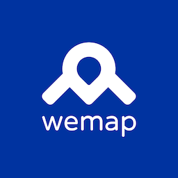

# Wemap SDK Sample apps Android



## Requirements

* AndroidStudio 2021.3.1 (or later)

## Installation

* download repository

* open project in `Android Studio`

* specify `accessKey` and `secretKey` in [`settings.gradle`](settings.gradle)

    ``` gradle
    maven {
        url "s3://mobile-dev.getwemap.com/wemap/sdk/android"
        credentials(AwsCredentials) {
            accessKey System.getenv("AWS_ACCESS_KEY_ID") // put your access key here or export it as an env variable
            secretKey System.getenv("AWS_SECRET_ACCESS_KEY") // put your secret key here or export it as an env variable
        }
    }
    ```

* specify `mapId` and `token` in [`Constants.kt`](map/src/main/java/com/getwemap/example/map/Constants.kt)

* build and run `map` build variant
